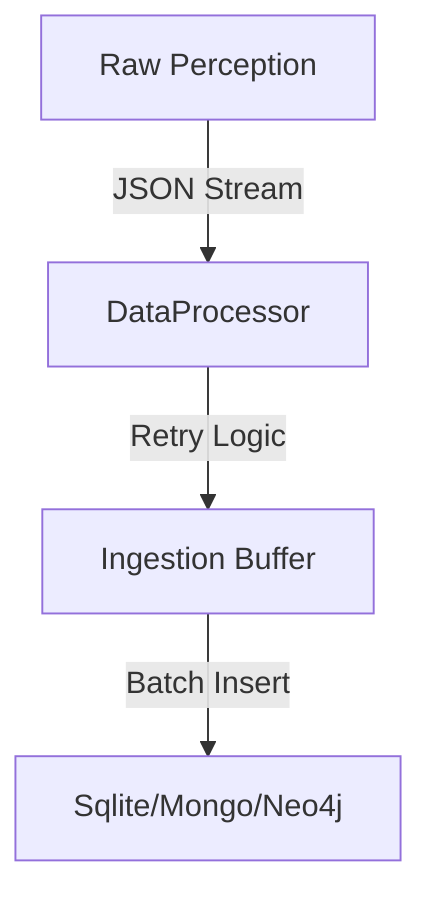

# `LICENSE` **ZERO Ingestor** — The Settlement Layer

> **"Data is only useful when it is where it belongs."**

The ZERO Ingestor is a high-concurrency pipeline designed to move, transform, and settle data into permanent storage. From SQLite to Neo4j, it treats every database as a deterministic endpoint.

---

## ⚡ SETTLEMENT TARGETS

* **Relational:** SQLite, PostgreSQL.
* **Document:** MongoDB.
* **Graph:** Neo4j (Relationship Mapping).
* **Vector:** Qdrant, Pinecone (Embedding Support).

---

## 📊 PIPELINE ARCHITECTURE

---

By **The Neuro-Catalyst Group**
