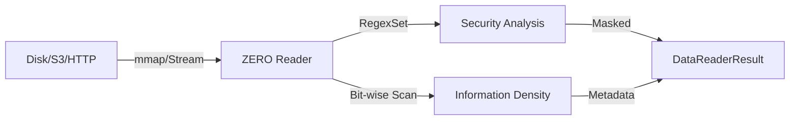

# `LICENSE` **ZERO Reader** — The Eye of the Needle

> **"If you can't see the data without loading it into RAM, you don't own the data."**

The ZERO Reader is the foundational engine for data access. It implements **Zero-Copy memory mapping** to scan gigabytes of resources in milliseconds. It doesn't just read; it perceives structure, entropy, and risk before a single byte is rendered.

---

## ⚡ ARCHITECTURAL LEVERAGE

| Feature           | ZERO Reader             | Standard Parser          | Leverage Factor |
| :---------------- | :---------------------- | :----------------------- | :-------------- |
| **Memory Usage**  | **mmap (Constant)**     | Heap Allocation (Linear) | **Infinite**    |
| **Scan Speed**    | **~2.4 GB/s**           | 150 - 300 MB/s           | **8x - 10x**    |
| **PII Detection** | **RegexSet (Parallel)** | Sequential Grep          | **5x Faster**   |
| **Connectivity**  | **S3 / HTTP / Local**   | Local Only               | **Universal**   |

---

## 🔍 CORE PERCEPTION

### 1. Zero-Copy Routing

Optimized paths for **Parquet, CSV, JSON, and Avro**. It uses SIMD-accelerated scanning to identify delimiters and structures without moving data in memory.

### 2. Forensic Security Layer

Built-in `SecretScanner` that identifies **AWS Keys, Credit Cards, and PII** using high-speed `RegexSet`. Data is neutralized at the stream level.

### 3. Entropy Analysis

Calculates **Information Density** to distinguish between compressed data, encrypted blobs, and raw text structures.

---

## 📊 SYSTEM BLUEPRINTS

### The Path of a Single Byte

---

By **The Neuro-Catalyst Group**
