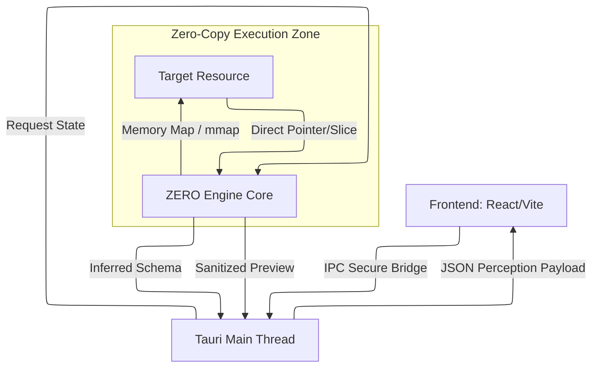
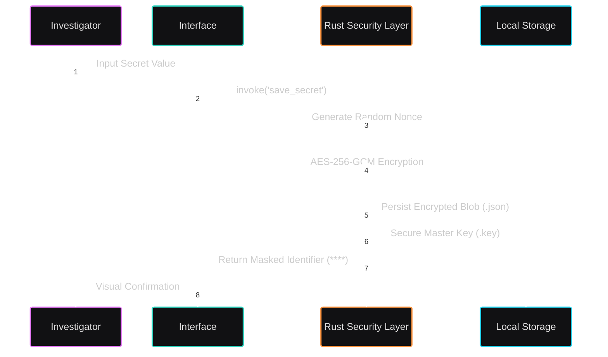

# `UNLICENSE` **ZERO UI** — The Perception Layer

> **"25MB of Pure Muscle in a World of 100MB+ Bloat."**

The ZERO UI is not just a frontend; it's a high-performance **Control Center** built on Tauri v2. It acts as the visual cortex for the ZERO Engine, bridging the gap between raw binary streams and human insight with **zero latency**.

---

## ⚡ ARCHITECTURAL LEVERAGE

We stripped away the Chrome engine (Electron) and replaced it with the native OS webview + Rust. The result is a desktop application that respects your hardware.

| Metric           | ZERO UI           | Standard Electron App | Leverage Factor    |
| :--------------- | :---------------- | :-------------------- | :----------------- |
| **Binary Size**  | **~25 MB**        | 120 MB+               | **5x Smaller**     |
| **RAM Idle**     | **< 80 MB**       | 400 MB+               | **5x Lighter**     |
| **Startup Time** | **< 300ms**       | 2-5s                  | **10x Faster**     |
| **Backend**      | **Rust (Native)** | Node.js (V8)          | **Hardware-Level** |

---

## 🖥️ INTERFACE MODULES

### 1. The Inspector (Deep Perception)

* **Universal Drag & Drop:** Throw Parquet, JSON, CSV, or 2GB+ log files at it.
* **Remote Streaming:** Connect directly to S3 or HTTP endpoints without downloading.
* **Automated PII Redaction:** Sensitive data (emails, keys) is masked *before* render.
* **Structure Visualization:** See the skeleton of your data instantly.

### 2. Stronghold Vault (Identity Management)

* **Local Encryption:** All keys/tokens stored using **AES-256-GCM**.
* **Hardware-Backed:** Integrates with OS keychain where possible.
* **Wipe Protocol:** One-click global destruction of all secrets.

### 3. History & Audit Log

* **Persistence:** SQLite-backed session history.
* **Traceability:** Know exactly what was inspected and when.
* **Privacy:** History is local-only and can be purged instantly.

### 4. System Settings (The Control Lever)

* **Engine Tuning:** Toggle Zero-Copy mode or Schema Inference.
* **Defense Levels:** Adjust strictness of PII redaction.
* **Theme:** Dark-mode optimized for long-exposure operations.

---

## 📊 SYSTEM BLUEPRINTS

### 1. The Flow of Perception

Visualizing the deterministic bridge between raw data and human insight.



### 2. Identity Fragment Protection (Vault)

How secrets are neutralized and persisted.



---

## 🛠️ DEVELOPMENT & BUILD

Designed for rapid iteration and atomic deployment.

### Prerequisites

* Node.js (pnpm preferred)
* Rust (1.82+)
* OS-specific build tools (build-essential, etc.)

### Launch Sequence

```bash
# 1. Install Dependencies
pnpm install

# 2. Ignite Development Mode (Hot Reload)
pnpm tauri dev

# 3. Compile Release Binary (The 25MB Artifact)
pnpm tauri build
```

---

## 🔐 SECURITY MODEL

* **CSP (Content Security Policy):** Strict. No external scripts.
* **Isolation:** The UI thread cannot access the filesystem directly; it must request the Rust Core via IPC commands.
* **Permissions:** Granularly scoped. The UI can only "read" what you explicitly select.

---

By **The Neuro-Catalyst Group**
